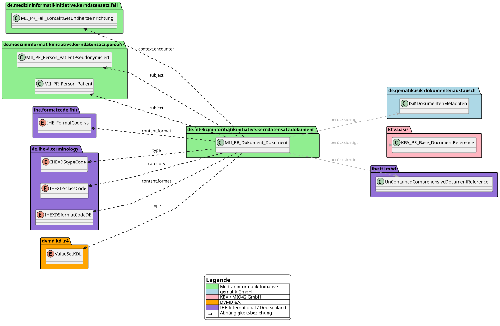

# Guidance for Implementers - MII IG Dokument v2027.0.0-ballot.rc2

* [**Table of Contents**](toc.md)
* [**Guidance**](guidance.md)
* **Guidance for Implementers**

## Guidance for Implementers

Domain context of the **Dokument** module for DIC implementers: its relationships to the other MII KDS modules and the external standards it is kept compatible with.

### Context

Medical documents are essential for comprehensive patient care, for the traceability of diagnoses and treatments, and for compliance with legal and scientific standards. They also play an important role in billing medical services and support efficient resource planning in the health system.

Both the technical and the content-related requirements of documentation in healthcare are highly dynamic. As a consequence, large differences in information structures have developed between institutions. Archiving and discoverability in particular come with a high diversity of metadata.

In the context of the MII core datasets, the MII KDS module Dokument introduces a harmonised, national concept that builds on established code systems and value sets and orchestrates an interoperable handling of medical documents.

### Relationship to Other MII KDS Modules

For certain data elements, this MII KDS module builds on existing work from other MII KDS modules in order to achieve harmonisation and increase compatibility. The dependencies on that prior work are described below.

| | | |
| :--- | :--- | :--- |
| [Person (in the base module)](https://simplifier.net/packages/de.medizininformatikinitiative.kerndatensatz.base) | The majority of medical documentation relates to patients. The MII KDS module Person is used to reference the link between patient and document. In some cases the documentation focuses on medical objects, procedures or administrative acts. That is the only reason why the reference to the MII KDS module Person is marked as optional (`subject`0..1, Must Support). | Yes (where a patient reference exists) |
| [Fall (in the base module)](https://simplifier.net/packages/de.medizininformatikinitiative.kerndatensatz.base) | Where the referenced document relates to an encounter with a healthcare facility, it should point directly to the most suitable level of contact of the MII KDS module Fall. That level typically depends on the document type. | No |

### Use by Other MII KDS Modules

The MII KDS module is based on the [FHIR DocumentReference](https://www.hl7.org/fhir/R4/documentreference.html). FHIR DocumentReferences are already used in other MII KDS modules. We recommend migrating to the MII KDS module specified here.

Should the specified document categories and types not adequately cover the requirements of a domain, the use of further domain-specific code systems and value sets is permitted.

| | | |
| :--- | :--- | :--- |
| [Consent](https://simplifier.net/packages/de.medizininformatikinitiative.kerndatensatz.consent) | The MII KDS module references consent documents, e.g. in scanned form. A relation to an encounter is conceivable. | No |
| [Studie](https://simplifier.net/packages/de.medizininformatikinitiative.kerndatensatz.studie) | The MII KDS module references study documents. Documents may also exist without a patient reference. | No |
| [Bildgebung](https://simplifier.net/packages/de.medizininformatikinitiative.kerndatensatz.bildgebung) | The MII KDS module references documents as a substitute for structured diagnostic reports. | No |
| [Molgen Befund](https://simplifier.net/packages/de.medizininformatikinitiative.kerndatensatz.molgen) | The MII KDS module references a number of document types which are, however, bound to existing standards. | No |
| [Meta](https://simplifier.net/packages/de.medizininformatikinitiative.kerndatensatz.meta) | The MII KDS module extends numerous profiles with search parameter definitions — including those for the MII KDS module Dokument. | No |

### Referenced Standards

The MII KDS module Dokument is designed so that instances can be compatible with the following FHIR-based standards at the same time:

* [KBV base profiles with Medical Information Objects (MIO)](https://simplifier.net/base1x0) – profile for referencing external or attached documents
* [Gematik Information Technology Systems in Hospitals (ISiK) document exchange, Stufe 6](https://simplifier.net/packages/de.gematik.isik/6.0.0) - profile for representing the metadata required for document exchange
* [IHE Mobile access to Health Documents (MHD)](https://profiles.ihe.net/ITI/MHD) - profile for exchanging health documents via mobile applications, mobile devices or other resource- and platform-constrained systems

This specification follows the FHIR core specification for the [DocumentReference resource](https://www.hl7.org/fhir/R4/documentreference.html#resource). The existing profiles of the [KBV base profiles](https://simplifier.net/base1x0), of [Gematik ISiK](https://simplifier.net/packages/de.gematik.isik/6.0.0) and of [IHE MHD](https://profiles.ihe.net/ITI/MHD) were taken into account during modelling with regard to freedom from contradiction (see the [Compatibility](kompatibilitaet.md) page). It is important to note here that compatibility from clinical routine towards the Dokument reference can be ensured, but that backward compatibility into routine care is not intended. See also the package dependency diagram:

The packages `de.medizininformatikinitiative.kerndatensatz.person` and `de.medizininformatikinitiative.kerndatensatz.fall` shown in the diagram have been delivered inside the base module (`de.medizininformatikinitiative.kerndatensatz.base`) since the KDS release 2026; the canonical URLs of the referenced profiles are unchanged. The diagram shows the state approved by the NSG.

This makes it possible to attribute resources such that they are valid against MII KDS as well as against ISiK or IHE at the same time. ISiK and IHE modules are also compatible in principle; in use, however, we recommend stating both the `type` (from KDL / ISiK) and the `category` (from IHE), which neither of the two profiles ISiK, IHE offers at the same time.

In doing so, all data elements as well as the terminology used were reconciled and represented in the [Dokument profile](StructureDefinition-mii-pr-dokument-dokument.md). The cardinalities are kept open, so that no (further or new) restrictions were introduced in this respect. The terminology used in the reconciled profiles was incorporated and represented in the [Dokument profile](StructureDefinition-mii-pr-dokument-dokument.md).

Person-related documents are assigned to a person (the base module's Patient / PatientPseudonymisiert profiles) (`subject`, 0..1). De-identified documents are marked accordingly via the security level (`securityLabel`). The data-holding site is responsible here for referencing only the corresponding anonymised or pseudonymised variants of other MII modules. Wherever possible, an encounter relation (MII KDS module Fall) is defined – where feasible at the most relevant level of the encounter-level model (`context.encounter`). In the package dependency diagram (above), the relationships between the MII modules are shown in green.

We recommend the [DVMD KDL standard](https://simplifier.net/kdl), which is also used in ISiK, for the precise type description (`type`), as well as the [IHE XDS class codes](https://art-decor.org/art-decor/decor-valuesets--ihede-?id=1.2.276.0.76.11.32&effectiveDate=2018-07-13T13:23:15&language=de-DE) for the coarser document category (`category`). [IHE XDS type and class codes can be derived unambiguously from KDL.](https://simplifier.net/kdl/~resources?category=ConceptMap) Further codings such as in-house codes, SNOMED CT or LOINC are optionally possible.

-------

The field-by-field comparison with ISiK document exchange, KBV MIO Basis and IHE MHD is on the [Compatibility](kompatibilitaet.md) page; the module's technical artifacts are under [Profiles](profiles.md). The KDS-wide conformance requirements (requirement language, Must Support, handling of missing data) are maintained centrally by the [Meta module](https://github.com/medizininformatik-initiative/kerndatensatz-meta/wiki/Conformance); they apply to this module unchanged.

