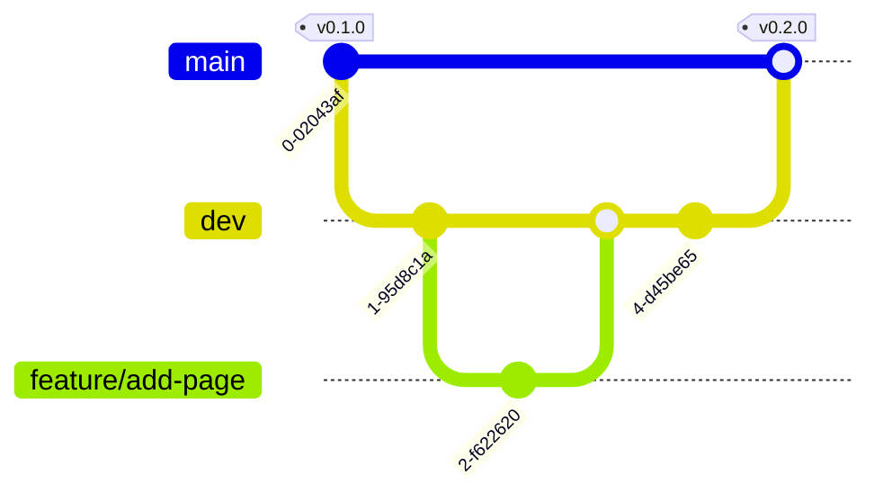

# Contributing

Thank you for contributing! This page explains the branching model, the commit
convention, and how a change reaches a release of this module.

This repository is the **MII KDS module IG "Dokument"**. It is released with
**CalVer `YYYY.n.n`** via the MII Module Release Workflow
([`docs/release.md`](docs/release.md)) — there is no SemVer automation here. The
full operational model is in [`docs/workflows.md`](docs/workflows.md).

## Branching model

Two long-lived branches, short-lived working branches:

- **`main` — stable release branch.** Always in a released, buildable state;
  every commit on `main` corresponds to a released (or release-ready) version.
  Protected: no direct pushes, pull requests require one approval. `main` is
  the **default branch**, so it is what visitors see first.
  > **Why main is default:** a visitor should land on, and start from, the
  > released state — not work-in-progress.
- **`dev` — integration branch, unstable.** Where reviewed changes accumulate
  between releases; may be temporarily broken. Protected: changes arrive only
  via pull request. CI preview builds run here.
  > **Back-merge rule:** if anything ever lands on `main` without going through
  > `dev` (a hotfix, a release commit), `main` must be merged back into `dev`
  > before the next `dev → main` merge — otherwise the two drift apart.
- **`release/vYYYY.n.n` — release-preparation branches.** The `release/**`
  name arms the convention check's strict release mode (an unresolved
  placeholder or an undecided optional page fails there); see
  [docs/release.md](docs/release.md).
- **`feature/*`, `change/*`, `fix/*` — short-lived working branches.** Branched
  **off `dev`**, one focused change each, merged back into `dev` via PR, then
  deleted. Name them descriptively (`feature/add-terminology-page`,
  `fix/footer-contrast`).
  > **Why short-lived off dev:** long-running branches diverge and become
  > painful to merge; small branches keep review cheap and history legible.

> Reads as: work happens on short-lived `feature/*` off `dev`; `dev`
> integrates; `dev → main` is the release gate, and a human pushes the CalVer
> tag `vYYYY.n.n` on `main`.

### Flow — making one change

1. Branch `feature|change|fix/<topic>` off `dev`.
2. Commit using Conventional Commits (cheat-sheet below); open a PR
   **targeting `dev`**.
3. On green CI + review, **squash-merge** into `dev` (one clean Conventional
   Commit per change), delete the branch.
4. To release: open a **`dev` → `main` PR** (the release-candidate gate, a
   human-in-the-loop point). Merge it as a **merge commit, not a squash**, so
   the individual Conventional Commits reach `main`. The CalVer tag is then
   pushed on `main` and `module-release.yml` takes over
   ([`docs/recipes/cut-a-release.md`](docs/recipes/cut-a-release.md)).
   > **Why a merge commit for dev → main:** the release notes are written from
   > the individual Conventional Commits on `main`. Squashing `dev → main`
   > would collapse them to one line.

## Conventional Commits — cheat-sheet

Every commit message (and PR title, since PRs are squash-merged) follows
[Conventional Commits](https://www.conventionalcommits.org/en/v1.0.0/):
`<type>: <short description>` — for example `feat: add terminology page`.

| Type | Use for |
| --- | --- |
| `feat` | A new capability (a profile, an extension, a page) |
| `fix` | A bug fix |
| `docs` | Documentation only |
| `chore` | Maintenance (configs, housekeeping) |
| `ci` | CI workflow changes |
| `refactor` | Restructuring, no behaviour change |
| `test` | Adding or fixing tests |

Breaking change: add `!` after the type (`feat!: …`) and explain the break in
the commit body.

> **Why Conventional Commits:** the module version is set by hand (CalVer, see
> [`docs/release.md`](docs/release.md)), but the release notes are generated
> from these commits — a wrong type puts a change in the wrong section, or
> hides it.

## Pull request expectations

- One focused change per PR; keep diffs reviewable.
- PRs target `dev`. `main` normally receives work only as the `dev → main`
  release merge.
- **If something does have to go straight into `main`** — a fix that cannot wait
  for the next release — the change is not finished until `main` has been merged
  back into `dev`. Skipping the back-merge is what makes the two branches
  diverge.
- CI must be green before merge.
- Please follow the [Code of Conduct](CODE_OF_CONDUCT.md).

## How this relates to the MII process

Everything above is **this repository's** workflow. It is not an MII rule, and
this repository does not speak for the MII.

The MII does publish rules for commenting on a Kerndatensatz module, and this
module sits inside them. They are in
the [**KDS governance, version 4.0 (7 May 2026)**](https://www.medizininformatik-initiative.de/sites/default/files/2026-07/KDS-Governance-v4.pdf),
adopted by the National Steering Committee and linked from the
[MII core-data-set page](https://www.medizininformatik-initiative.de/en/medical-informatics-initiatives-core-data-set):

- **Where comments go.** After FHIR profiling, a module runs a commenting round.
  Comments are filed either through the HL7 Deutschland ballot portal **or as an
  issue in the module's own GitHub repository** (§5.1.2) — so a module's issue
  tracker is a sanctioned channel, not an informal one.
- **Who may comment, and for how long.** Anyone may comment; the round is
  announced in advance and runs for a defined window (§3.5.4). Voting on an HL7
  ballot is a separate matter and is restricted to HL7 Deutschland members.
- **The module team must answer.** Every comment is answered — accepted or
  rejected, with a reason (§3.5.4).
- **Comments are public by default.** A commenter may ask for their identity to
  be pseudonymised.

Two things the MII does **not** publish, which are worth knowing so you do not
go looking:

- **No code of conduct**, anywhere — see [CODE_OF_CONDUCT.md](CODE_OF_CONDUCT.md).
- **No `CONTRIBUTING.md` for a KDS module** — not in the reference module
  `kerndatensatz-basis`, not in any other `kerndatensatz-*` repository, and not
  as an organisation-level default. (A couple of the MII's *software* repos
  carry one; no core-data-set module does.) The one participation rule
  published organisation-wide is how to request GitHub access, on the
  [MII organisation profile](https://github.com/medizininformatik-initiative/.github/blob/main/profile/README.md):
  email the Geschäftsstelle with the subject *"Zugang zum GitHub der MII"*.

> **Cite version 4.0, not what you may find first.** The
> `medizininformatik-initiative/kerndatensatz-governance` repository still
> announces version 3, ships no document and has not been touched since January
> 2024. Version 3.0's tooling chapter — GitHub, SharePoint, Simplifier, Zulip
> access — was **removed** in 4.0 and replaced by an appendix marked *in
> Arbeit*, so those instructions are no longer published guidance.
