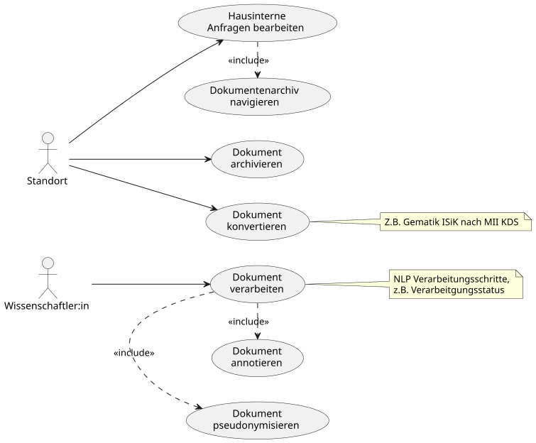
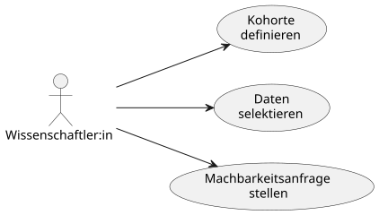

# Anleitung - MII IG Dokument v2027.0.0-ballot.rc1

* [**Table of Contents**](toc.md)
* **Anleitung**

## Anleitung

Dieser Abschnitt bündelt die fachlichen Hinweise zur Umsetzung und Nutzung des Moduls **Dokument**.

Grundsätzlich soll mit dem [Dokument-Profil](StructureDefinition-mii-pr-dokument-dokument.md) die Möglichkeit gegeben werden Dokumente aus der klinischen Routine, sowohl intern als auch extern, interoperabel zu nutzen. Die definierten Metadaten unterstützen die Auffindbarkeit, Selektion und Weiterverarbeitung dieser Dokumente. Dokumente aus der klinischen Routine bilden jedoch eine sehr heterogene Gruppe. Eine Vielzahl unterschiedlicher Quellsysteme, historisch gewachsene Strukturen und Terminologien – wie zum Beispiel interne Hauscodes zur Kategorisierung der Dokumentarten – verhindern eine effektive Nutzung vor Ort und über die Standorte hinweg.

### Anwendungsszenarien

#### Interne Dokumentennutzung

Die **Interne Dokumentennutzung** umfasst die Archivierung, Verwaltung und Nutzung klinischer Dokumente innerhalb eines Krankenhauses oder einer klinischen Einrichtung. Dabei stehen die Datenintegrationszentren (`Standort`) als zentrale Instanzen für die Datenverwaltung im Fokus.

##### Archivierung und Auffindbarkeit klinischer Dokumente

Datenintegrationszentren sollen in der Lage sein, klinische Dokumente zusammen mit ihren Metadaten zu archivieren (`Dokument archivieren`) und auffindbar (`Dokumentenarchiv navigieren`) zu machen. Die Metadaten, die im [Dokument-Profil](StructureDefinition-mii-pr-dokument-dokument.md) beschrieben werden, umfassen unter anderem:

* Dokumententyp (z. B. Arztbrief, Befundbericht),
* Bezeichner (z. B. eindeutige IDs),
* Erstellungsdatum,
* Autor und
* Zugehörigkeit zu einem Patienten.

Durch die standardisierte Beschreibung dieser Metadaten wird eine effiziente Navigation im Archiv ermöglicht. Ärzte und andere klinische Nutzer können Dokumente gezielt anfragen (`Hausinterne Anfragen bearbeiten`) und durchsuchen, um relevante Informationen zu finden.

##### Konvertierung bestehender Dokumente

Ein weiterer wichtiger Aspekt der **Internen Dokumentennutzung** ist die Konvertierung (`Dokument konvertieren`) von klinischen Dokumenten und Metadaten, die nach anderen Interoperabilitätsstandards (z. B. HL7 CDA, Gematik ISiK, KBV MIO) vorliegen, in einen Datensatz gemäß dem [Dokument-Profil](StructureDefinition-mii-pr-dokument-dokument.md). Diese Konvertierung stellt sicher, dass auch ältere oder anders erzeugte Dokumente und Metadaten integriert und einheitlich verwaltet werden können.

##### Nutzung durch Wissenschaftler:innen: Annotation und Pseudonymisierung

Neben den vorher beschriebenen Zwecken spielt die **Interne Dokumentennutzung** ebenso eine Rolle in der Forschung. Wissenschaftler:innen können im Rahmen von Natural Language Processing (NLP)-Prozessen Zwischenergebnisse und Verarbeitungsschritte gemäß dem [Dokument-Profil](StructureDefinition-mii-pr-dokument-dokument.md) speichern (`Dokument verarbeiten`). Zum Beispiel können die Zwischenergebnisse einzelner aufeinander aufbauender Prozessierungsschritte miteinander verknüpft und dokumentiert werden (`Dokument pseudonymisieren`, `Dokument annotieren`). Dadurch wird die Nachvollzieh- und Reproduzierbarkeit von NLP-Pipelines für Wissenschaftlicher:innen unterstützt.

#### Externe Dokumentennutzung

Die **Externe Dokumentennutzung** zielt auf die Bereitstellung von klinischen Dokumenten und deren Metadaten für Forschungszwecke ab. Hierbei steht die Nutzung durch Wissenschaftler:innen im Vordergrund, die auf Basis der archivierten Daten neue Erkenntnisse gewinnen möchten.

Wissenschaftler:innen (`Wissenschaftler:in`) können auf einen mit Metadaten angereicherten Korpus klinischer Dokumente zugreifen (`Kohorte definieren`). Die Metadaten, die gemäß dem [Dokument-Profil](StructureDefinition-mii-pr-dokument-dokument.md) beschrieben werden, ermöglichen eine gezielte Auswahl und Filterung der Dokumente (`Daten selektieren`). So können beispielsweise Dokumente eines bestimmten Typs, aus einem bestimmten Zeitraum oder von einer bestimmten Kohorte identifiziert werden.

Ein zentraler Bestandteil für Forschenden ist der Zugang zu Daten und Metadaten klinischer Dokumente über das Forschungsdatenportal für Gesundheit (FDPG). Darüber können Wissenschaftler:innen Machbarkeitsanfragen stellen (`Machbarkeitsanfrage stellen`), um zu prüfen, ob die benötigten Daten für bspw. eine geplante Studie verfügbar sind. Das Forschungsdatenportal nutzt die im [Dokument-Profil](StructureDefinition-mii-pr-dokument-dokument.md) hinterlegten Informationen, um die Benutzeroberflächen zu generieren. Beispielsweise werden die Metadaten zu Dokumententypen, Bezeichnern und Beschriftungen verwendet, um die Formulare dynamisch zu erstellen.

Für den Datentransport wird empfohlen den Dokumentkörper in die Ressource einzubetten. Die Dateien können hier auch zuvor komprimiert werden. Zusätzliche Dateien, die für die Interpretation und Nachnutzung des Dokuments notwendig sind (z.B. TypeSystem Dateien bei semantisch annotierten Dokumenten) können so auch direkt beigefügt werden.

### Weiterführende Seiten

* **[Datensätze und Beschreibungen](logical-models.md)** — die Datenelemente des Moduls, beschrieben als logische Modelle.
* **[UML-Diagramme](uml-diagrams.md)** — visuelle Darstellung der Datenmodelle und ihrer Beziehungen.
* **[Anleitung für Implementierende](implementer-guidance.md)** — technische Hinweise für DIZ-Implementierende.

Für die KDS-weiten Konformitätsanforderungen siehe die [Konformitätsregeln des Meta-Moduls](https://github.com/medizininformatik-initiative/kerndatensatz-meta/wiki/Conformance); für die technischen Artefakte siehe [Profile](profiles.md).

