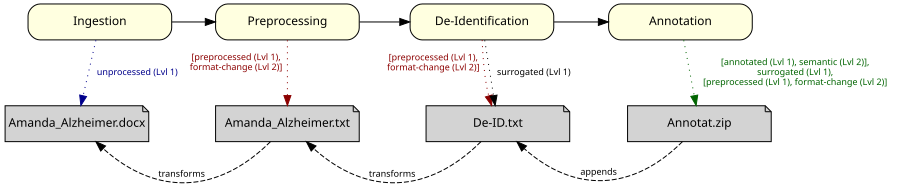

# Beispiele - MII IG Dokument v2027.0.0-ballot.rc1

* [**Table of Contents**](toc.md)
* **Beispiele**

## Beispiele

Diese Seite führt die Beispielinstanzen des Moduls **Dokument** auf.

> **Nur synthetische Daten** — niemals echte oder realistisch wirkende Patientendaten in Beispielen verwenden.

### Beispielszenario: NLP-Pipeline „Amanda Alzheimer“

Das folgende Beispiel illustriert die Verarbeitung eines **ärztlichen Entlassbriefes** der Patientin **Amanda Alzheimer** durch eine NLP-Pipeline (siehe Abbildung). Nach der Erschließung (`Ingestion`) des Originaldokuments `Amanda_Alzheimer.docx` wird eine Dokumentreferenz mit dem NLP-Verarbeitungsstatus `unprocessed` angelegt. Anschließend wird das Dokument durch eine Vorverarbeitung (`Preprocessing`) in das Klartextformat `Amanda_Alzheimer.txt` überführt. Die zugehörige Dokumentreferenz kennzeichnet den NLP-Verarbeitungsstatus `preprocessed, format-change` und verweist mittels `transforms` auf das Originaldokument. Anschließend wird eine De-Identifikation (`De-Identification`) der Inhalte durchgeführt, um das Ergebnisdokument `De-ID.txt` datenschutzkonform für Forschungszwecke weiterverwenden zu können. Eine zugehörige Dokumentreferenz kennzeichnet den NLP-Verarbeitungsstatus `preprocessed, format-change, surrogated` und verweist mittels `transforms` auf das Klartextdokument. Abschließend werden die klinischen Inhalte annotiert, was unter Umständen mehrere Ergebnisdateien produziert und sich als Archiv `Annotat.zip` zusammenfassen lassen. Die zugehörige Dokumentreferenz kennzeichnet den NLP-Verarbeitungsstatus durch die akkumulierten Codes der vorangegangenen Stufen als `[annotated, semantic], surrogated, [preprocessed, format-change]` und erweitert mittels `appends` die Dokumentreferenz des vorherigen NLP-Verarbeitungsschritts.

**Bitte beachten**: Mit dem Element `relatesTo` können Beziehungen zwischen den unterschiedlichen Referenzen eines Dokumentes hergestellt werden. Die Codebezeichnungen `transforms` und `appends` bezeichnen hierbei die Art der Beziehung:

* `transforms`: Dieses Dokument hat seinen Ursprung im relationierten Original aber wurde inhaltlich oder strukturell verändert. Zum Beispiel wenn ein Original Dokument im CDA-Format in ein Textformat übertragen wurde.
* `appends`: Dieses Dokument basiert auf dem relationierten Dokument, enthält aber zusätzliche Informationen wie z.B. Annotation in Form von Metadaten erhalten.

#### Beispielinstanzen

Die folgenden FHIR DocumentReference-Ressourcen verwendeten das Dokument-Profil ([MII PR Dokument Dokument](StructureDefinition-mii-pr-dokument-dokument.md)), um die Ergebnisdokumente und die zugehörigen Dokumentreferenzen jedes Verarbeitungsschrittes der NLP-Pipeline darzustellen.

| | | | |
| :--- | :--- | :--- | :--- |
| [Original-Dokument](DocumentReference-AmandaAlzheimerOriginalDokument.md) | DocumentReference | Ingestion (Original) | `Amanda_Alzheimer.docx` |
| [Klartext-Dokument](DocumentReference-AmandaAlzheimerKlartextDokument.md) | DocumentReference | Preprocessing (Klartext-Extraktion) | `Amanda_Alzheimer.txt` |
| [De-identifiziertes Dokument](DocumentReference-AmandaAlzheimerDeIdentifiziertesDokument.md) | DocumentReference | De-Identification | `De-ID.txt` |
| [Annotiertes Dokument](DocumentReference-AmandaAlzheimerAnnotiertesDokument.md) | DocumentReference | Annotation | `Annotat.zip` |
| [Patientin](Patient-AmandaAlzheimer.md) | Patient | Kontext | – |
| [Einrichtungskontakt](Encounter-AmandaAlzheimerEinrichtungskontakt.md) | Encounter | Kontext | – |
| [Abteilungskontakt](Encounter-AmandaAlzheimerAbteilungskontakt.md) | Encounter | Kontext | – |
| [Versorgungsstellenkontakt](Encounter-AmandaAlzheimerVersorgungsstellenKontakt.md) | Encounter | Kontext | – |

#### DocumentReference-Ressourcen der Pipeline

Jede Registerkarte zeigt die JSON-Darstellung der Dokumentreferenz eines Verarbeitungsschritts; die Artefaktseite ist jeweils verlinkt.

[AmandaAlzheimerOriginalDokument](DocumentReference-AmandaAlzheimerOriginalDokument.md) (DocumentReference)

[AmandaAlzheimerKlartextDokument](DocumentReference-AmandaAlzheimerKlartextDokument.md) (DocumentReference)

[AmandaAlzheimerDeIdentifiziertesDokument](DocumentReference-AmandaAlzheimerDeIdentifiziertesDokument.md) (DocumentReference)

[AmandaAlzheimerAnnotiertesDokument](DocumentReference-AmandaAlzheimerAnnotiertesDokument.md) (DocumentReference)

#### Patient- und Encounter-Ressourcen

Die zum Beispiel gehörenden FHIR Patienten- und Fall-Ressourcen werden ausschließlich vom Originaldokument `Amanda_Alzheimer.docx` und der zugehörigen Dokumentreferenz verwendet.

[AmandaAlzheimer](Patient-AmandaAlzheimer.md) (Patient)

[AmandaAlzheimerEinrichtungskontakt](Encounter-AmandaAlzheimerEinrichtungskontakt.md) (Encounter)

[AmandaAlzheimerAbteilungskontakt](Encounter-AmandaAlzheimerAbteilungskontakt.md) (Encounter)

[AmandaAlzheimerVersorgungsstellenKontakt](Encounter-AmandaAlzheimerVersorgungsstellenKontakt.md) (Encounter)

Alle Beispiele sind vollständig synthetisch.

Quelle: [GraSCCo Datensatz, DOI (Zenodo): 10.5281/zenodo.6539130](https://doi.org/10.5281/zenodo.6539130)

