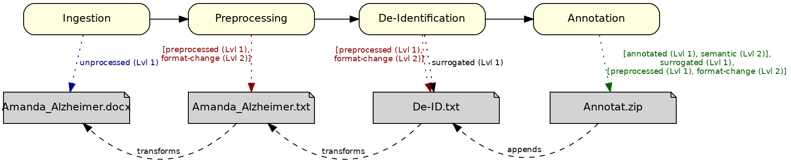

# MII EX Dokument NLP Processing Status - MII IG Dokument v2027.0.0-ballot.rc1

* [**Table of Contents**](toc.md)
* [**Artifacts Summary**](artifacts.md)
* **MII EX Dokument NLP Processing Status**

## Extension: MII EX Dokument NLP Processing Status 

| | |
| :--- | :--- |
| *Official URL*:https://www.medizininformatik-initiative.de/fhir/ext/modul-dokument/StructureDefinition/mii-ex-dokument-nlp-processing-status | *Version*:2027.0.0-ballot.rc1 |
| Active as of 2026-09-04 | *Computable Name*:MII_EX_Dokument_NLP_Processing_Status |

Status der NLP-Verarbeitung des referenzierten Dokuments

**Context of Use**

## Description

This extension serves the structured description of the processing status of a document within an NLP project. Processing documents that carry unstructured information typically happens in a series of consecutive processing steps. In the course of these process chains, different transformations of the original document arise, as well as relations between the source document and the intermediate products derived from it.

For this purpose the NLP extension provides a code system with which the various processing states and intermediate products of an NLP workflow can be described and archived consistently.

The code system of the NLP extension is hierarchical and comprises two levels: level 1 (Lvl 1) and level 2 (Lvl 2). Lvl 1 describes a superordinate process status, for example annotated. Lvl 2 serves to specify that status. One example is the combination Lvl 1: `annotated`, Lvl 2: `deid`, which indicates that a document has been furnished with de-identifying annotations.

Using both hierarchy levels is not mandatory. Depending on the respective application scenario, it can be decided freely whether only the superordinate status (Lvl 1) or additionally a specific differentiation via Lvl 2 is used. Please note: if a Lvl 2 specification such as `deid` is used, the corresponding Lvl 1 `annotated` must also be used. Otherwise `deid` could be misunderstood as a fully de-identified document.

An exemplary use case is a document within an annotation project that has already been extracted from a source system and anonymised. Several processing steps may have taken place up to the current processing state, for example:

* transformation of the file format from `.pdf` to `.txt` (`preprocessed` – `format-change`)
* removal of document headers (`preprocessed` – `content-change`)
* machine pre-annotation of identifying structures (`annotated` – `preanno` `deid`)
* subsequent manual annotation of those structures (`annotated` – `deid`)
* irreversible replacement of all identifying annotations by surrogates (`surrogated`)

The NLP extension deliberately leaves degrees of freedom in documenting such process chains. It is possible to represent every processing step of a document. Alternatively, the description may be limited to selected processing states that are essential for the respective use case, for example exclusively to the final status surrogated.

## Content

> **Written during migration — review before release.** The technical structure of this extension — differential, key elements, snapshot and the XML and JSON serialisations — is rendered by the IG Publisher directly below this section on this artifact page. The Must Support elements with their short descriptions and comments are shown there as well; canonical URL, status, version and base definition are carried by the page header.The codes of the NLP processing status are defined by the code system [MII CS Dokument NLP Processing Status](CodeSystem-mii-cs-dokument-nlp-processing-status.md) with its two-level hierarchy; the extension is bound via the value set [MII VS Dokument NLP Processing Status](ValueSet-mii-vs-dokument-nlp-processing-status.md).

## Examples

The following example illustrates the processing of a **physician's discharge letter** of the patient **Amanda Alzheimer** by an NLP pipeline (see figure). After the ingestion (`Ingestion`) of the original document `Amanda_Alzheimer.docx`, a document reference with the NLP processing status `unprocessed` is created. The document is then converted by a preprocessing step (`Preprocessing`) into the plain-text format `Amanda_Alzheimer.txt`. The corresponding document reference marks the NLP processing status `preprocessed, format-change` and points to the original document by means of `transforms`. Afterwards a de-identification (`De-Identification`) of the contents is carried out so that the resulting document `De-ID.txt` can be reused for research purposes in a data-protection-compliant way. A corresponding document reference marks the NLP processing status `preprocessed, format-change, surrogated` and points to the plain-text document by means of `transforms`. Finally the clinical contents are annotated, which may produce several result files that can be combined into the archive `Annotat.zip`. The corresponding document reference marks the NLP processing status through the accumulated codes of the preceding stages as `[annotated, semantic], surrogated, [preprocessed, format-change]` and, by means of `appends`, extends the document reference of the previous NLP processing step.



**Please note**: with the element `relates to`, relationships between the different references of a document can be established. The code designations `transforms` and `appends` denote the kind of relationship:

* `transforms`: this document originates from the related original but has been changed in content or structure. For example, when an original document in CDA format has been converted into a text format.
* `appends`: this document is based on the related document but contains additional information, for example annotations in the form of metadata.

The following FHIR DocumentReference resources used the document profile ([MII PR Dokument Dokument](StructureDefinition-mii-pr-dokument-dokument.md)) to represent the result documents and the associated document references of each processing step of the NLP pipeline.

| | |
| :--- | :--- |
| `Amanda_Alzheimer.docx` | [Original document](DocumentReference-AmandaAlzheimerOriginalDokument.md) |
| `Amanda_Alzheimer.txt` | [Plain-text document](DocumentReference-AmandaAlzheimerKlartextDokument.md) |
| `De-ID.txt` | [De-identified document](DocumentReference-AmandaAlzheimerDeIdentifiziertesDokument.md) |
| `Annotat.zip` | [Annotated document](DocumentReference-AmandaAlzheimerAnnotiertesDokument.md) |

The following FHIR resources represent the patient and encounter resources belonging to the example. These FHIR resources are used exclusively by the original document `Amanda_Alzheimer.docx` and its associated document reference.

| | |
| :--- | :--- |
| Amanda Alzheimer | [Patient](Patient-AmandaAlzheimer.md) |
| Institution encounter | [Encounter Einrichtungskontakt](Encounter-AmandaAlzheimerEinrichtungskontakt.md) |
| Department encounter | [Encounter Abteilungskontakt](Encounter-AmandaAlzheimerAbteilungskontakt.md) |
| Point-of-care encounter | [Encounter Versorgungsstellenkontakt](Encounter-AmandaAlzheimerVersorgungsstellenKontakt.md) |

> **Written during migration — review before release.** All examples are entirely synthetic; the full overview of the module's example instances is on the [Examples](examples.md) page.

Source: [GraSCCo dataset, DOI (Zenodo): 10.5281/zenodo.6539130](https://doi.org/10.5281/zenodo.6539130)

**Usage info**

**Usages:**

* Use this Extension: [MII PR Dokument Dokument](StructureDefinition-mii-pr-dokument-dokument.md)
* Examples for this Extension: [DocumentReference/AmandaAlzheimerAnnotiertesDokument](DocumentReference-AmandaAlzheimerAnnotiertesDokument.md), [DocumentReference/AmandaAlzheimerDeIdentifiziertesDokument](DocumentReference-AmandaAlzheimerDeIdentifiziertesDokument.md), [DocumentReference/AmandaAlzheimerKlartextDokument](DocumentReference-AmandaAlzheimerKlartextDokument.md) and [DocumentReference/AmandaAlzheimerOriginalDokument](DocumentReference-AmandaAlzheimerOriginalDokument.md)

You can also check for [usages in the FHIR IG Statistics](https://packages2.fhir.org/xig/resource/de.medizininformatikinitiative.kerndatensatz.dokument|current/StructureDefinition/StructureDefinition-mii-ex-dokument-nlp-processing-status.json)

### Formal Views of Extension Content

 [Description of Profiles, Differentials, Snapshots, and their representations](http://build.fhir.org/ig/FHIR/ig-guidance/readingIgs.html#structure-definitions). 

 

Other representations of profile: [CSV](../StructureDefinition-mii-ex-dokument-nlp-processing-status.csv), [Excel](../StructureDefinition-mii-ex-dokument-nlp-processing-status.xlsx), [Schematron](../StructureDefinition-mii-ex-dokument-nlp-processing-status.sch) 


## Resource Content

```json
{
  "resourceType" : "StructureDefinition",
  "id" : "mii-ex-dokument-nlp-processing-status",
  "url" : "https://www.medizininformatik-initiative.de/fhir/ext/modul-dokument/StructureDefinition/mii-ex-dokument-nlp-processing-status",
  "version" : "2027.0.0-ballot.rc1",
  "name" : "MII_EX_Dokument_NLP_Processing_Status",
  "title" : "MII EX Dokument NLP Processing Status",
  "status" : "active",
  "date" : "2026-09-04T12:20:18+00:00",
  "publisher" : "NUM-DIZ",
  "contact" : [{
    "name" : "NUM-DIZ",
    "telecom" : [{
      "system" : "url",
      "value" : "https://www.netzwerk-universitaetsmedizin.de"
    }]
  }],
  "description" : "Status der NLP-Verarbeitung des referenzierten Dokuments",
  "jurisdiction" : [{
    "coding" : [{
      "system" : "urn:iso:std:iso:3166",
      "code" : "DE",
      "display" : "Germany"
    }]
  }],
  "fhirVersion" : "4.0.1",
  "kind" : "complex-type",
  "abstract" : false,
  "context" : [{
    "type" : "element",
    "expression" : "DocumentReference"
  }],
  "type" : "Extension",
  "baseDefinition" : "http://hl7.org/fhir/StructureDefinition/Extension",
  "derivation" : "constraint",
  "differential" : {
    "element" : [{
      "id" : "Extension",
      "path" : "Extension",
      "short" : "MII EX Dokument NLP Processing Status",
      "definition" : "Status der NLP-Verarbeitung des referenzierten Dokuments"
    },
    {
      "id" : "Extension.extension",
      "path" : "Extension.extension",
      "max" : "0"
    },
    {
      "id" : "Extension.url",
      "path" : "Extension.url",
      "fixedUri" : "https://www.medizininformatik-initiative.de/fhir/ext/modul-dokument/StructureDefinition/mii-ex-dokument-nlp-processing-status"
    },
    {
      "id" : "Extension.value[x]",
      "path" : "Extension.value[x]",
      "short" : "NLP Processing Status",
      "definition" : "Status der NLP-Verarbeitung des referenzierten Dokuments",
      "min" : 1,
      "type" : [{
        "code" : "CodeableConcept"
      }],
      "mustSupport" : true
    },
    {
      "id" : "Extension.value[x].coding",
      "path" : "Extension.value[x].coding",
      "min" : 1,
      "mustSupport" : true,
      "binding" : {
        "strength" : "required",
        "valueSet" : "https://www.medizininformatik-initiative.de/fhir/ext/modul-dokument/ValueSet/mii-vs-dokument-nlp-processing-status"
      }
    },
    {
      "id" : "Extension.value[x].coding.system",
      "path" : "Extension.value[x].coding.system",
      "min" : 1,
      "fixedUri" : "https://www.medizininformatik-initiative.de/fhir/ext/modul-dokument/CodeSystem/mii-cs-dokument-nlp-processing-status",
      "mustSupport" : true
    },
    {
      "id" : "Extension.value[x].coding.code",
      "path" : "Extension.value[x].coding.code",
      "min" : 1,
      "mustSupport" : true
    }]
  }
}

```
