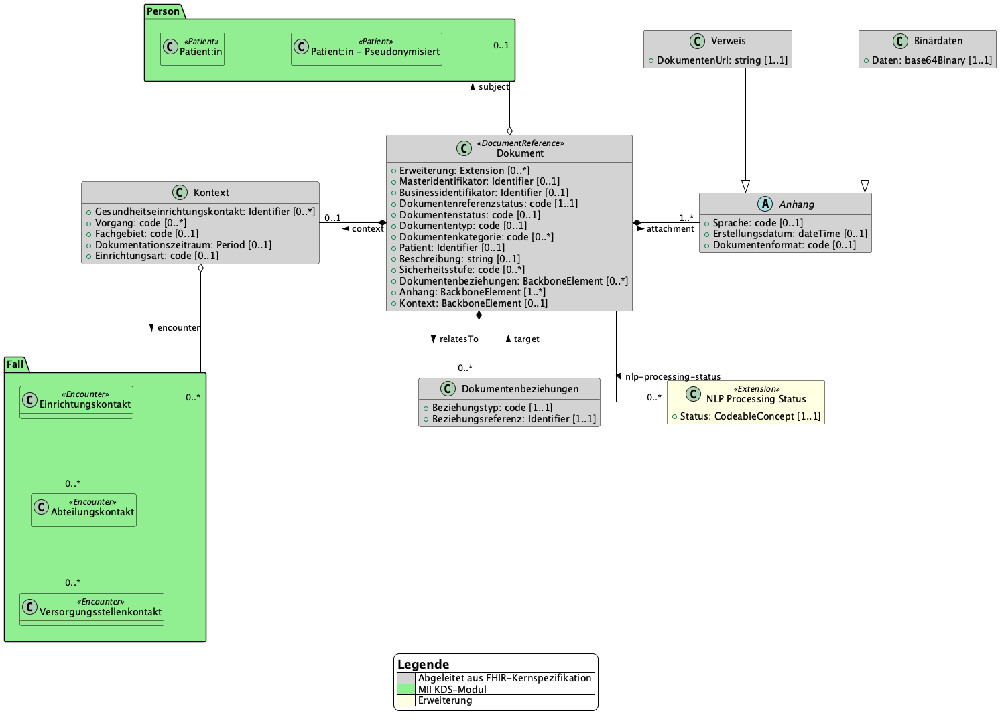

# UML Diagrams - MII IG Dokument v2027.0.0-ballot.rc1

* [**Table of Contents**](toc.md)
* [**Guidance**](guidance.md)
* **UML Diagrams**

## UML Diagrams

 This page includes translations from the original source language in which the guide was authored. Information on these translations and instructions on how to provide feedback on the translations can be found [here](translationinfo.html). 

To illustrate the information model, the following diagram was created in the Unified Modeling Language (UML). This makes it possible to better represent the domain concepts, their relationships, and the connection to other MII KDS modules.

A **Dokument** (document) is used to describe the metadata of a clinical document, or an image, audio, or video file. A **Dokument** is typically created in a clinical **Kontext** (context) (`context`). In addition, depending on the scenario, a **Dokument** can be related (`relatesTo`) in a specific way to one or more other **Dokumente**. One or more **Anhänge** (attachments) (`attachment`) are used to specify details about the storage location and format of the clinical document, or the image, audio, or video file.

Depending on the scenario, a **Dokument** can have a reference to a patient (`subject`) ([MII KDS module Person](https://simplifier.net/packages/de.medizininformatikinitiative.kerndatensatz.person)). The patient reference can be established using identifying attributes, or on a pseudonymous or anonymous basis. Similarly, a clinical **Kontext** (context) can be used to establish the reference to the specific case/encounter (`encounter`) ([MII KDS module Fall](https://simplifier.net/packages/de.medizininformatikinitiative.kerndatensatz.fall)).

